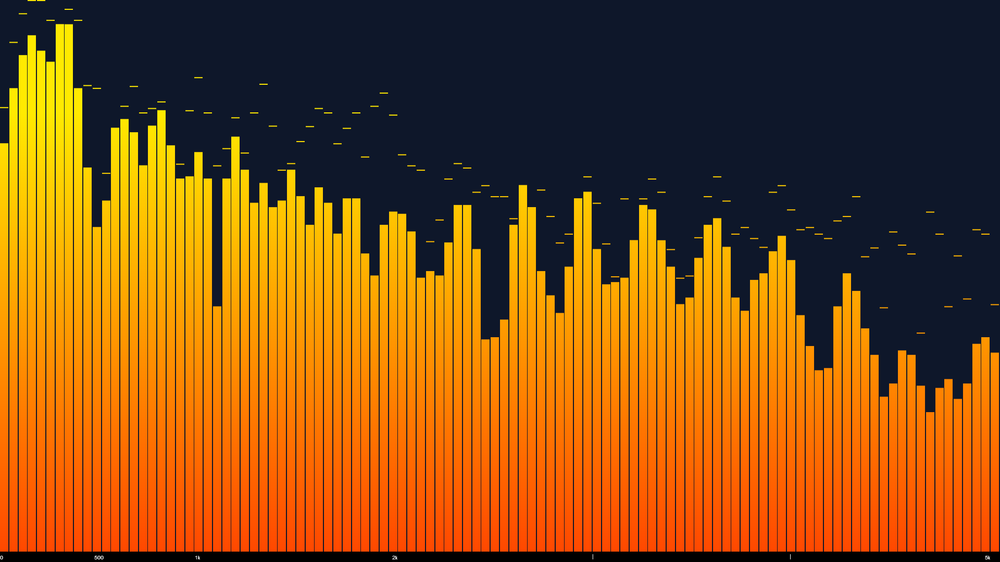
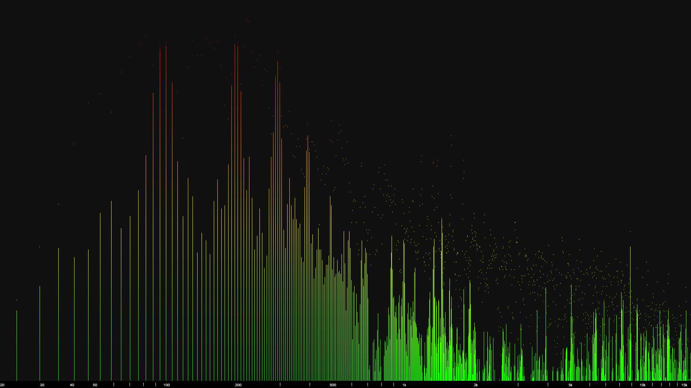

audioMotion.js
==============

A real-time graphic spectrum analyser and audio player using WebAudio API and canvas.

## Features

* Beautiful high-resolution graphic spectrum analyzer with fullscreen display
* Customizable logarithmic scale, for improved visualization of specific frequency ranges
* Customizable WebAudio API parameters (FFT size, sensitivity and time-smoothing)
* Built-in HTML5 audio player with playlist support
* Visualize audio input from your microphone as well, or "stereo mix" if your soundcard supports it
* Native JavaScript, with no external libraries or dependencies

## Demo

https://hvianna.github.io/audioMotion.js/

## Usage

In order to play and visualize music files located in your own computer, you'll need to set up a local web server, since JavaScript 
restrictions don't allow reading files directly from the client's hard disk. The easiest way to do this is by using [Docker](https://www.docker.com/). Once you have Docker installed and running, simply open a command prompt in the folder where you downloaded audioMotion to and run:

`docker-compose up -d`

and you should be able to access the player at `localhost:8000` in your browser.

The provided `docker-compose.yml` file maps an hypothetic folder named "music" in your home (user) directory so audioMotion can access files inside it as "/music/song.mp3", for example. This should work for the default "Music" folder on Windows. If you want to map a different
folder or drive, edit the line below in `docker-compose.yml`:

```
    - ~/music:/usr/local/apache2/htdocs/music/
```

and change `~/music` for your desired local path, for example `j:\media\music` or `/j/media/music`. On Windows, if you're using a drive other than C: you might need to add it to the shared drives in Docker's configuration.

Load an audio file into audioMotion by typing its path (relative to the server's document root) or remote URL (if the remote server allows cross-origin requests) and clicking the "Load" button. If you provide a file with extension `.m3u` or `.m3u8`, the player will try to read it and parse
individual files/URLs from its contents. Check the playlist.m3u in the `demo` folder for examples.

## Configuration options

### FFT Size

The number of samples used for the FFT performed by the analyzer. Larger values will provide greater detail on lower frequencies, but will require more CPU power.

### Range

The lowest and highest frequencies you want to see in the graphic spectrum analyzer. You can use this to zoom in a specific frequency range.

### Smoothing

Average constant used to smooth values between analysis frames. Lower values may produce better	results for faster tempo songs.

### Gradient

Several options of color gradients for the analyzer bars.

### Logarithmic scale

The logarithmic scale allocates more canvas space for lower frequencies, resulting in improved visualization of beats, bass and vocals. Unchecking this option will use a linear distribution of frequencies in the horizontal axis.

### Show scale

This option toggles the display of the frequency scale.

### High sensitivity

Check this option to increase the analyzer sensitivity and improve the visualization of low volume songs.

### Show peaks

Check this option to retain each frequency peak value for a short time.

## Screenshots


audioMotion.js visualizer interface


Full screen view: Linear scale, 20Hz-5KHz range, 1024-sample FFT, dusk gradient


Full screen view: Logarithmic scale, 20Hz-16KHz range, 8192-sample FFT, classic gradient

## References and acknowledgments

* audioMotion.js was largely inspired by [Soniq Viewer for iOS](https://itunes.apple.com/us/app/soniq-viewer/id448343005), by Yuji Koike
* Icons provided by [Font Awesome](https://fontawesome.com/)
* [WebAudio API documentation @MDN](https://developer.mozilla.org/en-US/docs/Web/API/Web_Audio_API)
* [WebAudio API Specification](https://webaudio.github.io/web-audio-api/)
* And of course, the community at [StackOverflow](https://stackoverflow.com/a/14789992/2370385)! :D

## Song credits

Songs included in the demo playlist:

* Albinoni's Adagio in G minor, Arr for alto saxophone and piano by David Hernando Vitores ([source](https://commons.wikimedia.org/wiki/File:Tomaso_Giovanni_Albinoni_-_Adagio_in_G_minor_-_Arr_for_alto_saxophone_and_piano_-_David_Hernando_Vitores.ogg))

  Licensed under [Creative Commons: Attribution-Share Alike 4.0 International](https://creativecommons.org/licenses/by-sa/4.0/deed.en)

* Brazilian National Anthem - Choral ([source](http://www.dominiopublico.gov.br/pesquisa/DetalheObraForm.do?select_action=&co_obra=2480))
  
  Public domain
  
* "The Factory" by Multifaros ([source](https://archive.org/details/The_Factory-3613))

  Licensed under [Creative Commons: By Attribution 3.0 License](http://creativecommons.org/licenses/by/3.0/)
  
* "Funky Chunk" by Kevin MacLeod (incompetech.com)

  Licensed under [Creative Commons: By Attribution 3.0 License](http://creativecommons.org/licenses/by/3.0/)
  
* "Spell" by Rolemusic ([source](https://archive.org/details/Straw_Fields-8753))

  Licensed under [Creative Commons: Attribution-Noncommercial-Share Alike 3.0 United States](http://creativecommons.org/licenses/by-nc-sa/3.0/us/)
  

## License

audioMotion.js is licensed under the [GNU Affero General Public License, version 3 or later](https://www.gnu.org/licenses/agpl.html).