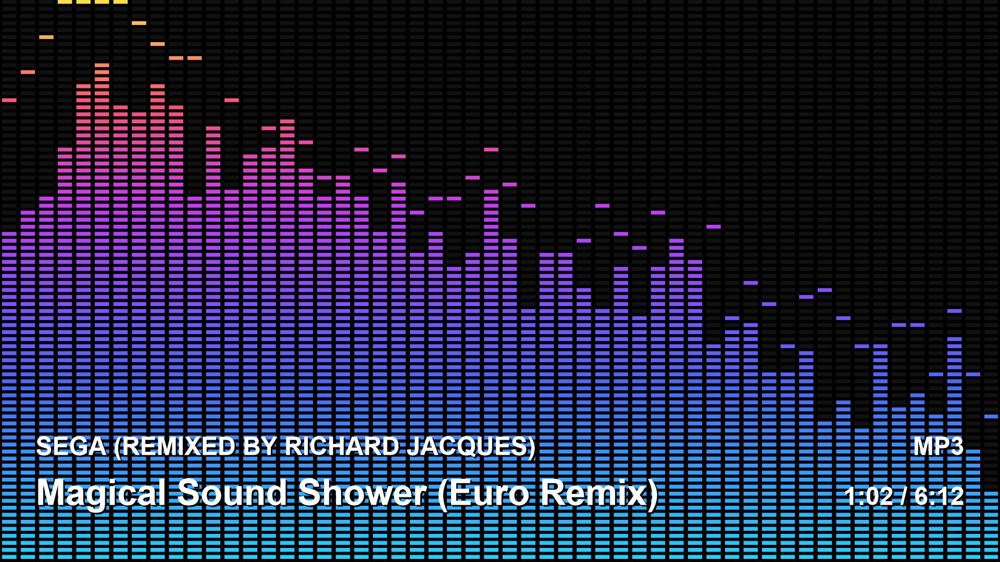
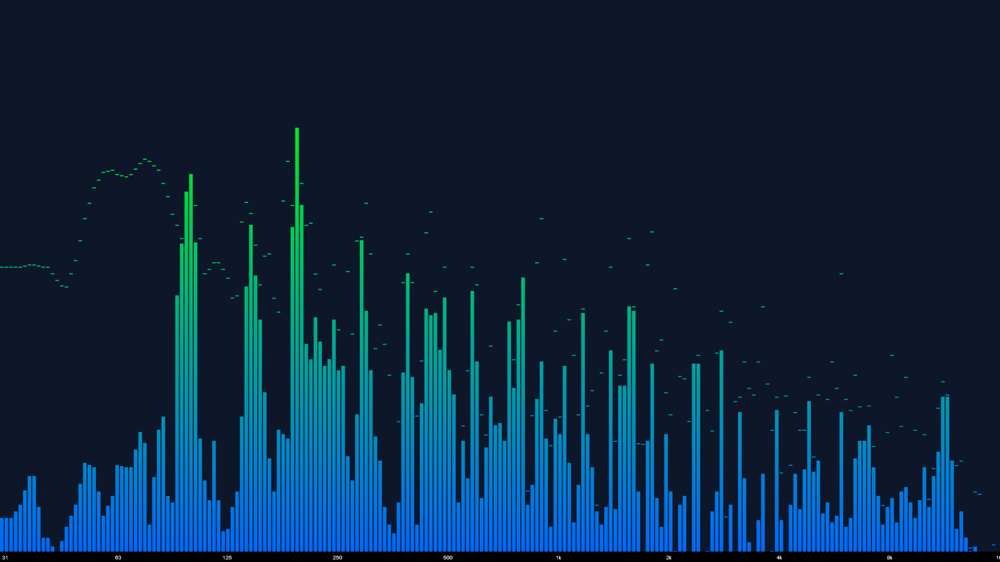

audioMotion.js
==============

[ ](https://github.com/hvianna/audioMotion.js/releases/latest)

A real-time graphic spectrum analyzer and audio player built with the *Web Audio* and *Canvas* JavaScript APIs.

## Features

* Beautiful high-resolution (retina / HiDPI ready) graphic spectrum analyzer with fullscreen display
* Logarithmic frequency scale with customizable range
* Visualize discrete frequencies, or octave bands based on the equal tempered scale
* Customizable Web Audio API parameters (FFT size, sensitivity and time-smoothing)
* Audio player with playlist support
* Visualize audio input from your microphone (or "stereo mix", if your soundcard supports it)
* Written entirely in vanilla JavaScript (ES6/ES2015 spec) — runs right out of the box in any modern browser

## Demo

https://hvianna.github.io/audioMotion.js/

## Basic usage

Download the [latest version](https://github.com/hvianna/audioMotion.js/releases/latest), unzip the package and open the `index.html` file in your browser.

You can load individual songs from your PC using the **Play a song** option. This allows for quick visualization of any song, but won't let you enqueue several songs for playback.

For a more practical listening / visualization session, the idea is that you use pre-defined playlists. More about that in the next section.

You can also make audioMotion "listen" to your microphone, by selecting *Microphone* in the **AUDIO SOURCE** setting.
If your sound card supports *Stereo mix* mode, you should be able to select it as the input device when requested to allow access to your microphone.
The *Stereo mix* input allows audioMotion to receive audio generated by other programs running in your PC. Please note that the graphic visualization from this source might suffer a slight delay.

## Using your own playlists

Due to browsers' security policies, JavaScript can only read files via the HTTP protocol.
So, in order to use your own playlists and get the best out of audioMotion, you'll need to set up a local web server to allow HTTP access to your music folder.<br>
<sub>Note: on Firefox you still can load local playlists and music files, if they're stored *inside audioMotion's folder* (tested up to Firefox version 66).</sub>

The easiest way to set up a local web server is by using [Docker](https://www.docker.com/). Once you have Docker installed and running, simply open a command prompt in the audioMotion folder and run:

`docker-compose up -d`

and you should be able to access audioMotion via HTTP by entering `localhost:8000` in your browser.

The provided configuration file maps the folder "music" in your user directory to the web server document root, so audioMotion can access files inside it as "music/song.mp3", for example.
This should work for the default "Music" folder on Windows. If you want to map a different folder or drive, edit the line below in `docker-compose.yml`:

```
    - ~/music:/usr/local/apache2/htdocs/music/
```

and change `~/music` for your desired local path, for example `j:\media\music` or `/j/media/music`. On Windows, if you're using a drive other than C: you might need to add it to the shared drives in Docker's configuration.

After you have your playlists configured, you can load a playlist in audioMotion by selecting it from the list and clicking the **LOAD** button.
This will **add** the selected playlist's content to the current playlist. You can see the queued songs in the box under **Playlist**.

The **SHUFFLE** button will randomize the order of queued songs. **CLEAR** clears the current playlist.

The **Repeat** option, when active, will make the player loop back to the first song after playing the last song on the playlist.

You can then use the player controls to play, pause and skip through songs in the playlist. You can also click a song in the playlist to play it.


## Playlists

The `playlists.cfg` file is where you register all the playlists you want to make available to audioMotion. This is a plain text file with one playlist per line, in the format `playlist title | playlist path and filename` (that's a "pipe" character between the title and the path). You can edit the playlists.cfg file in any plain text editor, like Windows' Notepad.

Example of playlists.cfg contents:

```
Pink Floyd albums | music/Rock/Pink Floyd/all-albums.m3u
Soundtrack mix | music/OST/best.m3u
Vince Guaraldi | music/jazz/vince guaraldi/playlist.m3u
Herbie Hancock | music/jazz/herbie hancock/playlist.m3u
```

Playlists themselves are also plain text files, containing one song per line. File extension must be `.m3u` or `.m3u8` for audioMotion to recognize it as a playlist. The [Extended M3U](https://en.wikipedia.org/wiki/M3U#Extended_M3U) #EXTINF directive is also supported to provide track information (artist and song name).

You can use a music player software that supports M3U playlists, like [foobar2000](https://www.foobar2000.org/) or [VLC](https://www.videolan.org/vlc/), to arrange your songs more easily and generate the playlist. On foobar2000, as of version 1.4.1, EXTM3U support can be enabled via *Preferences* > *Advanced* > *Tools* > *Write EXTM3U playlists*.

Make sure playlist entries do not contain absolute paths or drive letters - all paths should be relative to the location of the playlist file itself. And remember all files must be located below your mapped "music" folder so audioMotion can read them.

Example of an m3u playlist file:

```
(1971) Meddle\05 Seamus.flac
(1971) Meddle\06 Echoes.flac
(1973) The Dark Side of the Moon\01 Speak To Me - Breathe.flac
(1973) The Dark Side of the Moon\02 On The Run.flac
(1973) The Dark Side of the Moon\03 Time.flac
```

Note that you can use either Windows-style backslashes `\` or Linux-style forward slashes `/` in your pathnames. See the provided playlist files inside the `demo` folder for more examples.

As for the audio files themselves, audioMotion.js should be able to play most mainstream formats, like mp3, ogg, m4a and flac, but codec support may vary, depending on your web browser and operating system.

## Configuration Presets

The **Full resolution** and **Octave bands** presets adjust the FFT size, frequency range and smoothing configurations to recommended values for the discrete frequencies and octave bands visualization modes.

You can tweak any options and save a favorite configuration by clicking the **Save** button. You can later revert to this configuration by selecting the **Custom** preset.

Additionally, your last used configuration will be automatically saved and restored the next time you open audioMotion.
You can manually select the **Last session** preset to undo any changes made during the current session.

## Configuration options


Below you'll find a brief description of each configuration option.

### Visualization

Selects the visualization mode. *Discrete frequencies* allows you to visualize individual frequencies, limited only by the resolution of both the [FFT](https://en.wikipedia.org/wiki/Fast_Fourier_transform) and your display.
The *octave bands* modes will display wider bars, representing ranges of frequencies based on a [24-tone equal tempered scale](https://en.wikipedia.org/wiki/Quarter_tone).

You can cycle through the available modes using the **V** keyboard shortcut.

### FFT Size

The number of samples used for the [FFT](https://en.wikipedia.org/wiki/Fast_Fourier_transform) performed by the analyzer. Larger values provide greater detail of lower frequencies, but require more CPU power.

### Range

The lowest and highest frequencies you want to see in the graphic spectrum analyzer. You can use this to zoom in a specific frequency range.

### Smoothing

Average constant used to smooth values between analysis frames. Lower values make the analyzer react faster to changes, and may look better with faster tempo songs. Increase it if the animation looks too "jumpy".

### Gradient

Several options of color gradients for the analyzer bars. You can change gradients with the **Up** and **Down** arrow keys, or alternatively, **I** and **M** keys.

### Switches (on / off)

In the list below, the character inside brackets indicates the keyboard shortcut, when available.

+ **INFO** toggles the on-screen display of song information on every track change
+ **[S]CALE** toggles the display of the frequency scale on the X-axis; clicking the visualization area or pressing the **S** key also toggles this option
+ **SE[N]S** increases analyzer sensitivity to improve the visualization of songs too quiet
+ **[P]EAKS** shows volume peaks for each frequency

+ **[B]G** when active, sets a black background for the analyzer, instead of the color defined by each gradient (improves contrast)
+ **[A]UTO** when active, every track change will select the next gradient, cycling through the available options
+ **[L]ED** applies a vintage LED effect to the analyzer bars

+ **FLAT** applies an outline instead of shadow on text displayed on canvas - may improve performance on some graphic cards
+ **LO-RES** reduces canvas resolution to improve rendering speed (especially useful for 4K+ displays)

## Fullscreen mode and keyboard shortcuts

Click the **Fullscreen Analyzer** button to display the spectrum analyzer in fullscreen.

You can use the keyboard shortcuts below to control the player and change display settings without leaving fullscreen mode:

| key | alternate | action |
|-----|-----------|--------|
**Left arrow** | **J** | play previous song
**Right arrow** | **K** | play next song
**Space** | | play / pause
**Up arrow** | **I** | select previous gradient
**Down arrow** | **M** | select next gradient
**A** | | toggle auto gradient change (AUTO switch)
**B** | | toggle black background (BG switch)
**D** | | display current song and configuration information on screen
**F** | | toggle fullscreen mode
**L** | | toggle LED effect on analyzer bars (LED switch)
**N** | | toggle analyzer sensitivity (SENS switch)
**P** | | toggle peaks display (PEAKS switch)
**S** | click on analyzer | toggle frequency scale display on/off (SCALE switch)
**V** | | change visualization mode

## Screenshots

audioMotion.js user interface


Full screen view: 1/6th-octave bands mode with LED effect, "Outrun" gradient, showing on-screen information


Full screen view: Discrete frequencies mode, 20Hz-22KHz, 8192-sample FFT, "Classic" gradient


Full screen view: 1/24th-octave bands, 30Hz-16KHz, 16384-sample FFT, "Aurora" gradient


## References and acknowledgments

* audioMotion.js was largely inspired by the aesthetics of [Soniq Viewer for iOS](https://itunes.apple.com/us/app/soniq-viewer/id448343005), by Yuji Koike
* [Web Audio API documentation @MDN](https://developer.mozilla.org/en-US/docs/Web/API/Web_Audio_API)
* [Web Audio API Specification](https://webaudio.github.io/web-audio-api/)
* [HTML Canvas Reference @W3Schools](https://www.w3schools.com/tags/ref_canvas.asp)
* [What does the FFT data in the Web Audio API correspond to?](https://stackoverflow.com/a/14789992/2370385)
* [HTML5 check if audio is playing?](https://stackoverflow.com/a/46117824/2370385)
* [Unlocking Web Audio — the smarter way](https://hackernoon.com/unlocking-web-audio-the-smarter-way-8858218c0e09)
* [localStorage polyfill](https://developer.mozilla.org/en-US/docs/Web/API/Web_Storage_API/Local_storage)
* [Equations for equal-tempered scale frequencies](http://pages.mtu.edu/~suits/NoteFreqCalcs.html)
* Icons by [icons8](https://icons8.com) licensed under [Creative Commons Attribution-NoDerivs 3.0 Unported](https://creativecommons.org/licenses/by-nd/3.0/)
* Gradients [*Candy*](https://gradienthunt.com/gradient/172), [*Miami*](https://gradienthunt.com/gradient/950), [*Outrun*](https://gradienthunt.com/gradient/317) and [*Tie Dye*](https://gradienthunt.com/gradient/969) from [Gradient Hunt](https://gradienthunt.com)
* Gradients *Pacific Dream*, *Shahabi*, *Summer* and *Sunset* from [uiGradients](https://uigradients.com)
* Gradients used in the UI buttons from [ColorZilla's Ultimate CSS Gradient Generator](http://www.colorzilla.com/gradient-editor/)

## Song credits

Songs included in the demo playlists:

* Albinoni — Adagio in G minor, Arr for alto saxophone and piano by David Hernando Vitores ([source](https://commons.wikimedia.org/wiki/File:Tomaso_Giovanni_Albinoni_-_Adagio_in_G_minor_-_Arr_for_alto_saxophone_and_piano_-_David_Hernando_Vitores.ogg))<br>Licensed under [CC BY-SA 4.0](https://creativecommons.org/licenses/by-sa/4.0/deed.en)
* Brazilian National Anthem - Choral ([source](http://www.dominiopublico.gov.br/pesquisa/DetalheObraForm.do?select_action=&co_obra=2480)) - Public domain
* "The Factory" by Multifaros ([source](https://archive.org/details/The_Factory-3613)) - Licensed under [CC BY 3.0](http://creativecommons.org/licenses/by/3.0/)
* "Funky Chunk" by Kevin MacLeod ([incompetech.com](https://incompetech.com)) - Licensed under [CC BY 3.0](http://creativecommons.org/licenses/by/3.0/)
* "Spell" by Rolemusic ([source](https://archive.org/details/Straw_Fields-8753)) - Licensed under [CC BY-NC-SA 3.0 US](http://creativecommons.org/licenses/by-nc-sa/3.0/us/)
* "We Come Together" by LukHash ([source](https://archive.org/details/ShMusic-DigitalMemories/)) - Licensed under [CC BY-NC-ND 3.0](http://creativecommons.org/licenses/by-nc-nd/3.0/)
* Test tones created with [Audacity](https://www.audacityteam.org/).

## License

audioMotion.js copyright (c) 2018-2019 Henrique Vianna<br>
Licensed under the [GNU Affero General Public License, version 3 or later](https://www.gnu.org/licenses/agpl.html).