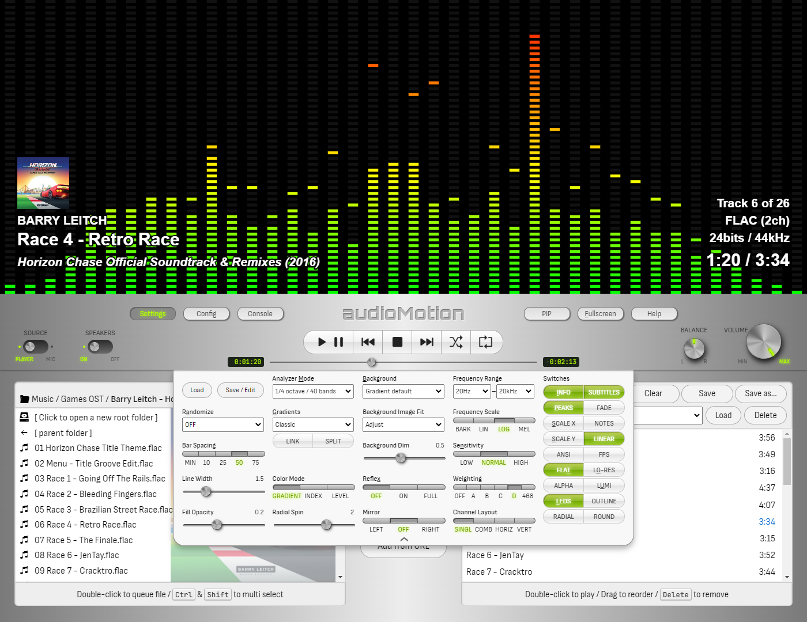
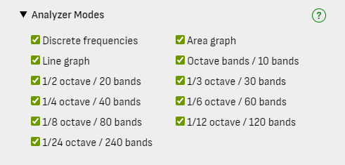
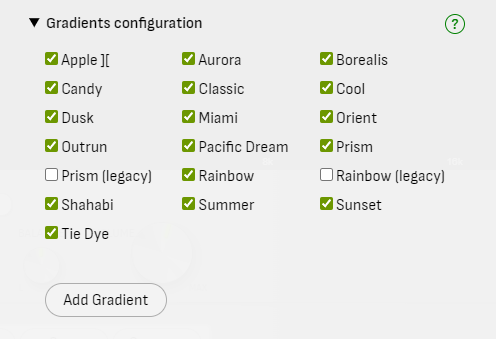
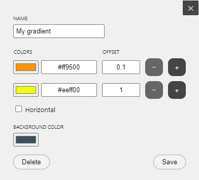
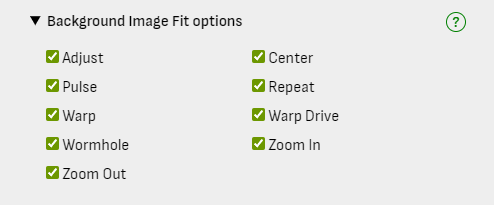
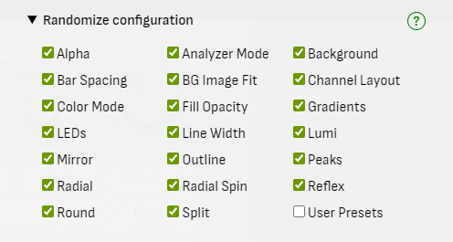
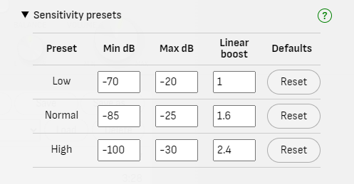
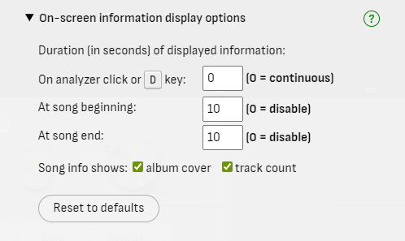

# User's Manual

## Top panel buttons

- **Settings** - open / close the [Settings](#settings-panel) panel
- **Config** - open the [Config](#config-panel) panel
- **Console** - open / close the message [Console](#console)

- **PIP** - display the spectrum analyzer in a Picture-In-Picture window
- **Fullscreen** - display the spectrum analyzer in fullscreen
- **Help** - show **audioMotion** version, documentation links and the [keyboard shortcuts](#keyboard-shortcuts)

## Source and Speakers

Move the **Source** switch to the **MIC** position to capture audio from your microphone instead of the media player.
When MIC is selected, the Speakers are automatically turned off to prevent feedback loops from the speakers.
If you're using headphones you can safely turn the Speakers on to listen to the microphone audio.

If your sound card supports *Stereo mix* mode, this option may be listed as an input device when you set the Source to MIC.
The *Stereo mix* input allows audioMotion to read audio generated by any program running in your PC.

Source and speakers settings will be automatically restored next time you open **audioMotion**.

## Player controls

| button | action |
|:------:|:-------|
|  | Play / pause |
|  | Previous track - Hold to rewind |
|  | Stop playback and reset the queue pointer to the first song |
|  | Next track - Hold to fast forward |
|  | Shuffle queue and start playback |
|  | Play queue on repeat |

## Balance and Volume

Hover the mouse over the Balance and Volume knobs and use the **mouse wheel** to adjust them.

**Double-click** the Balance knob to center it.

Balance can also be adjusted with **Shift** + **Left** and **Right** arrow keys, and Volume with the **Up** and **Down** arrow keys.

Balance and volume settings will be automatically restored next time you open **audioMotion**.

## File explorer and play queue

The **file explorer** allows you to navigate through folders and files on your device or on the server.

| button | action |
|:-------|:-------|
**Switch to Server / Device** | Switches between browsing music folders on your local device or hosted on the server. *(Requires [browser support](known-issues.md))*
**Add selected**  | Add currently selected files in the file explorer to the play queue
**Add all files** | Add all files in the current folder to the play queue
**Add from URL**  | Load a remote audio file or stream from an URL
**Upload file**   | Play individual music files from your device. Uploaded files can't be added to queue or saved to playlists. *(Only displayed on browsers that do not support local file access)*

**Double-click** a file to quickly add it to the play queue.

Hold *Ctrl* to select multiple files, or *Shift* to select a range of files, then **drag and drop** selected files into the play queue, or use the **Add selected** button.

The first image found in the current folder will be shown in the background of the file explorer, with precedence given to filenames containing the words *cover*,
*folder* or *front* (in this order).

Supported file extensions are:
+ for music: **flac**, **m4a**, **mp3**, **ogg** and **wav**;
+ for video: **mkv**, **mpg**, **webm**, **mp4**, **avi** and **mov**;
+ for images: **jpg**, **jpeg**, **webp**, **avif**, **png**, **gif** and **bmp**;
+ for playlists: **m3u** and **m3u8**.

*Actual codec support may vary depending on browser and operating system.*

### Using the play queue and playlists <!-- {docsify-ignore} -->

Double-click a queued song to play it.

Drag and drop songs to reorder them inside the queue. Hold *Ctrl* to select multiple files, or *Shift* to select a range.
Press *Delete* (*Backspace* on Mac) to remove selected songs from the queue.

Use the **Clear** button to clear the queue.

The contents of the play queue are automatically restored the next time you open audioMotion. You can disable this feature in [Config panel - General settings](#general-settings).

You can also save the play queue contents to a named playlist by clicking the **Save as...** button.

Saved playlists appear in the playlist selection box.

Select a playlist and click one of the buttons:

| Button | Action |
|:-------|:-------|
**Save**       | Update the selected playlist with the current queue contents
**Save as...** | Saves the current queue contents to a new playlist
**Load**       | Load the selected playlist, **adding** its contents to the end of the current queue
**Delete**     | Permanently delete the selected playlist

!> Playlists are saved to the browser's storage and will only be accessible in the same browser they were saved.

## Settings Panel

Click **Settings** in the top panel buttons to open the Settings Panel.

### Load and Save Presets

Click the **Load** button to load a preset.

**audioMotion comes with 6 built-in presets that showcase different features of the analyzer, plus 9 slots for user-defined presets.**

The **Demo** preset will choose random visualization settings when loaded and will set [**Randomize**](#randomize) to 15 seconds, so it's a great way to quickly overview all of audioMotion's features!

You can also quickly pick random settings anytime, by pressing **0** in the keyboard.

Your last configuration will be automatically restored the next time you open audioMotion.
You can manually load the **Last session** preset to undo any changes made during the current session.

The **Restore defaults** preset resets all analyzer settings to their initial values, as in the first time you run audioMotion.

Click the **Save / Edit** button to save, update or delete a favorite configuration in one of the **user preset slots.**

The current settings can also be saved to a user slot by holding **Shift** and pressing the numbers **1** to **9** in the keyboard.

Quickly load a user preset by pressing the corresponding slot number in the keyboard (**1** to **9**).

!> User presets are saved to the browser's storage and will only be accessible in the same browser they were saved.

### Randomize

Selects random visualization settings on track change or time interval.

You can choose [which settings](#settings-affected-by-randomize) may be changed by Randomize in the [Config panel](#config-panel).

### Bar spacing

This setting is effective only when an [octave bands mode](#analyzer-mode) is selected. Avaliable options are:

| Bar Spacing | Description |
|-------------|-------------|
**Legacy** | ~1px spacing between analyzer bars
**Narrow** | 10% spacing, 90% bar width (default)
**Regular** | 25% spacing, 75% bar width
**Wide** | 50% spacing, 50% bar width
**Extra wide** | 75% spacing, 25% bar width

### Line Width and Fill Opacity

These settings are effective only for [Line graph mode](#analyzer-mode) or when [OUTLINE](#switches) switch is on.

**Line Width** controls the thickness of the graph line or outline stroke.

**Fill Opacity** adjusts the transparency of the graph area or bar fill. The [ALPHA](#switches) switch, when active, has precedence over the Fill Opacity (for octave bands modes only).

!> On **Firefox**, Fill Opacity may not work properly with [Radial](#switches) analyzer, due to [this bug](https://bugzilla.mozilla.org/show_bug.cgi?id=1164912).

### Analyzer Mode

Selects the visualization mode.

| Mode | Description |
|------|-------------|
| **Discrete frequencies** | Displays amplitudes of individual frequencies, as provided by the [FFT](https://en.wikipedia.org/wiki/Fast_Fourier_transform) computation
| **Area graph** | Uses the discrete frequency data points to create a filled area graph
| **Line graph** | Connects all the discrete data points in a continuous line graph - [line width and fill opacity](#line-width-and-fill-opacity) can be customized
| **Bands** | Frequencies are grouped in bands. When [Frequency Scale](#frequency-scale) is set to **LOG**, each bar represents the *n*th part of an octave

You can also select the visualization mode using the **M** and **Shift + M** keyboard shortcuts.

### Gradients

Select the color gradients used for the analyzer graphs. You can also change gradients using the **G** and **Shift + G** keyboard shortcuts.

You can disable specific gradients and **create your own gradients** in [Config - Add Gradient](#enabled-gradients).

The **LINK** and **SPLIT** switches control some specific features when using a dual [Channel Layout](#channel-layout):

| Switch    | Description |
|:----------|:------------|
| **LINK**  | Uses the same gradient for both analyzer channels
| **SPLIT** | Splits the gradient between both channels, so each channel will have different colors (VERT channel layout only)

### Color Mode

Selects the desired mode for coloring the analyzer bars. This property has no effect in **Area Graph** and **Line Graph** [modes](#analyzer-mode).

| Color Mode | Description | Preview ('prism' gradient)
|------------|-------------|----------------------------
| GRADIENT   | Analyzer bars are painted with the currently selected [Gradients](#gradients). | 
| INDEX      | Each analyzer bar is painted with a **single color** from the selected gradients, starting with the first color applied to the first bar, and so on, cycling through the available colors. | 
| LEVEL      | Colors from the selected gradient are used to paint each bar, according to its current level (amplitude). | 

### Radial Spin

Configure the radial analyzer spinning speed, when [RADIAL](#switches) switch is on.

### Background

Selects the analyzer background.

| Background | Description |
|------------|-------------|
| **Gradient default** | Uses the background color defined by the currently selected gradient - when the [LED switch](#switches) is on, this shows the "unlit" LEDs instead |
| **Black** | Uses a black background |
| **Album cover** | Displays the album cover for the current song (1) |
| **Random image** | Selects a random image from the backgrounds folder (2) |
| **Random video** | Selects a random video from the backgrounds folder (2) |

**( 1 )** Album covers will be preferably retrieved from the file's metadata. When a picture is not found in the metadata, **audioMotion** will look for image files
in the song's folder, and will pick any image which filename contains the words *cover*, *folder* or *front* (in this order), or the first image found otherwise.

**( 2 )** The web app includes a few built-in background images and videos. **You can select your own backgrounds folder in [Config - General settings](#general-settings).**
You can also customize how many files will be directly available in the selection box, but for large amounts of files use the *Random image* and *Random video* options to randomly choose among **all** files found in the backgrounds folder.

See also [Background Image Fit](#background-image-fit) and [Background Dim](#background-dim) settings for additional options for background images and videos.

You can cycle through the available options using the **B** keyboard shortcut.

?> **When a video file is loaded on the player** the Background setting has no effect, but you can still adjust the [Background Dim](#background-dim).

### Background Image Fit

When [Background](#background) is set to **Album cover** or an image, this option selects the size and positioning of the background image.

| Background Image Fit | Effect |
|----------------------|--------|
**Adjust** | Resizes the image so it fills the entire canvas
**Center** | Displays the image horizontally centered on the canvas (default)
**Pulse** | Makes the image pulsate to the beat of the song
**Repeat** | Repeats the image horizontally to fill the canvas
**Warp** | Applies a 3D "warp" effect to the background image
**Warp Drive** | Animated *Warp* effect
**Wormhole** | *Warp Drive* effect with additional rotation
**Zoom In** | Image is initially centered on the canvas and slowly zooms in as the song plays
**Zoom Out** | Image is initially enlarged at 200% and slowly zooms out as the song plays

You can cycle through the available options using the **Shift + B** keyboard shortcut.

Effects can be selectively disabled in the [Config panel](#config-panel).

!> The **Warp Drive** and **Wormhole** effects may degrade performance on some graphics cards.

### Background Dim

When a video file is playing, or the [Background](#background) is set to an image, video or album cover, this option **adjusts the brightness of the background.**

### Reflex

Selects a vertical reflection effect. On [bands modes](#analyzer-mode), this setting has no effect when the [LUMI](#switches) switch is active.

| Reflex: On | Reflex: Mirrored |
|:-----------:|:-------------:|
|  | 

### Mirror

Selects a horizontal mirroring effect to the left (low frequencies at the center) or to the right (high frequencies at the center).

| Mirror: Left | Mirror: Right |
|:-----------:|:-------------:|
|  | 

### Frequency Range

The lowest and highest frequencies represented in the spectrum analyzer. You can use this feature to "zoom in" a specific frequency range.

### Frequency Scale

| Scale    | Description | Frequency distribution preview (10Hz - 24kHz range)
|----------|-------------|-----------------------------------
| **BARK** | Bark scale | 
| **LIN**  | Linear scale | 
| **LOG**  | Logarithmic scale | 
| **MEL**  | Mel scale | 

Logarithmic scale allows the visualization of proper **octave bands** (see [Analyzer Mode](#analyzer-mode)) and it's also recommended when using the [**NOTES**](#switches) switch.

[*Bark*](https://en.wikipedia.org/wiki/Bark_scale) and [*Mel*](https://en.wikipedia.org/wiki/Mel_scale) are perceptual pitch scales, which may provide better visualization of mid-range frequencies, when compared to log or linear scales.

### Sensitivity

Adjusts the analyzer sensitivity to improve the visualization of songs too quiet or too loud. You can also use the **N** and **Shift + N** keyboard shortcuts.

Presets for low, normal and high sensitivity can be customized in the [Config panel](#config-panel).

### Weighting

[Weighting filter](https://en.wikipedia.org/wiki/Weighting_filter) applied to frequency data for spectrum visualization.

Each filter applies a different curve of gain/attenuation to specific frequency ranges, but the general idea is to adjust the
visualization of frequencies to which the human ear is more or less sensitive.

?> Weighting filters **do NOT** affect audio output. Some filters may impact performance, due to increased real-time data processing.

### Channel Layout

Selects single or dual channel display, with different layout options:

| Channel Layout | Description |
|----------------|-------------|
| **SINGL** | Single channel analyzer, representing the combined output of both left and right channels.
| **COMB**  | Dual channel analyzer, both channels overlaid. Works best with [**Line Graph** mode](#analyzer-mode) or [**OUTLINE**](#switches) switch on.
| **HORIZ** | Dual channel, side by side - see [Mirror](#mirror) for additional layout options.
| **VERT**  | Dual channel, left channel at the top half of the canvas and right channel at the bottom.

The channel layout setting does NOT affect stereo audio output.

### Switches

Switches toggle additional effects and alternative measurement, informational and performance features.

| Switch    | Description | Switch    | Description |
|:----------|:------------|:----------|:------------|
**INFO**    | Toggle on-screen display of song information on every track change | **PEAKS**   | Toggle display of amplitude peaks
**SCALE&nbsp;X** | Toggle display of scale on the horizontal axis (frequency)    | **NOTES**   | Switch between musical notes and frequency values for the labels displayed in the horizontal axis scale
**SCALE&nbsp;Y** | Toggle display of scale on the vertical axis (level/volume)   | **LINEAR**  | Switch between linear scale and decibels (logarithmic) to represent bar amplitudes
**ANSI**    | Switch between [ANSI/IEC preferred frequencies](https://archive.org/details/gov.law.ansi.s1.11.2004) and [equal-tempered scale](http://hyperphysics.phy-astr.gsu.edu/hbase/Music/et.html) to generate octave bands | **FPS**     | Toggle display of current frame rate at the top right corner
**FLAT**    | Switch between outlined (on) or shadowed (off) text for messages displayed on canvas  | **LO-RES**  | Toggle low resolution mode *(may improve performance, especially on 4K+ displays)*
**ALPHA**   | Toggle variable bar transparency - the higher the bar amplitude the more opaque it is | **LUMI**    | Toggle luminance bars effect - similar to ALPHA, but all analyzer bars are displayed at full-height *(no effect with RADIAL)*
**LEDS**    | Toggle LED effect for the analyzer bars *(bands modes only, no effect with RADIAL)*   | **OUTLINE** | Toggle bar outline mode - see [Line width and Fill opacity](#line-width-and-fill-opacity) settings *(bands modes only)*
**RADIAL**  | Toggle display of circular spectrum analyzer with radial bars. **This option disables both LEDS and LUMI effects.** | **ROUND**   | Toggle rounded corners at the top of analyzer bars *(bands modes only)*

## Config Panel

Click **Config** in the top panel buttons to open the Config Panel.

### Enabled Analyzer Modes

Uncheck the visualization modes you don't want to appear in the [Analyzer Mode](#analyzer-mode) selection box.

### Enabled Gradients

Uncheck the gradients you don't want to appear in the [Gradients](#gradients) selection box.

### Gradient Editor

Click the **Add Gradient** button to create a new color gradient, or click any custom gradient to edit it.

At least two colors are required to create a gradient, but you can add as many colors as you like.
The **offset** must be a number between 0 and 1 - use it to adjust the position of each color inside the gradient.

!> Custom gradients are saved to the browser's storage and will only be accessible in the same browser they were saved.

### Enabled options for Background Image Fit

Uncheck the options you don't want to appear in the [Background Image Fit](#background-image-fit) selection box.

### Settings affected by Randomize

Select which configuration settings may be changed by [Randomize](#randomize).

When **User Presets** is checked, Randomize will first load one of your [saved custom presets](#load-and-save-presets) and then choose random values for any other settings checked.
So if you want to randomize only among your custom presets, uncheck everything else!

### General settings

**FFT Size** is the number of samples used for the [Fast Fourier Transform](https://en.wikipedia.org/wiki/Fast_Fourier_transform) performed by the analyzer.

Higher values provide greater detail in the frequency domain (especially for low frequencies), but less detail in the time domain (slower response to changes).
The default value of **8192** usually provides the best cost/benefit ratio for both domains.

**Smoothing over time** is the averaging factor used to smooth FFT data between analysis frames.

Lower values make the analyzer react faster to changes, and may look better with faster tempo songs and/or larger FFT sizes.
Increase it if the analyzer animation looks too "jumpy".

**PIP window aspect ratio** selects the aspect ratio of the Picture-In-Picture window.
After entering PIP, the window can be resized and the selected aspect ratio will be preserved.

**Fullscreen Height** adjusts the height of the analyzer when in fullscreen. This can be used to provide a wider look to the analyzer.

You can also use the **Shift** + **Up** and **Down** arrows to adjust the analyzer height during fullscreen visualization.

**Maximum frame rate (FPS)** controls the maximum animation frame rate, in frames per second.
'Unlimited' will try to match your monitor's refresh rate, but may increase CPU usage.

**Backgrounds folder location** selects the source for images and videos that can be used as [Background](#background) options, or disable external background media.

Only files found in the selected folder will be loaded - subfolders are ignored. 
Loading backgrounds from the local device requires support for the *File System Access API*, which is [currently only available on Chromium-based browsers](known-issues.md).

**Maximum background items** controls the maximum number of media files that can be directly selected in the [Background](#background) setting.

**Auto-hide file panel on analyzer hover** - check to automatically hide the file explorer / play queue panel, when you move the mouse over the analyzer.

**Remember play queue contents** - check to automatically restore the contents of the play queue the next time you open audioMotion.

**Remember last music folder** - check to start the file explorer in the last previously used folder the next time you open audioMotion.

The **Reset to defaults** button will reset all settings above to their default values.

### Sensitivity presets

Customize low, normal and high [Sensitivity](#sensitivity) presets.

**Min dB** and **Max dB** represent the lowest and highest volume levels detected by the analyzer, in decibels.

The **Linear boost** value is used to perform an *n*th-root operation to amplify low energy values, when using the linear amplitude scale (see [LINEAR](#switches) switch).

?> Please note that **0** dB represents the loudest volume possible.

### On-screen information display options

Customize how long information is displayed on screen when user requests it by clicking the analyzer or via keyboard shortcut (**D** key),
and also on song beginning and end.

You can also toggle the display of album covers and track.

## Console

Click **Console** in the top panel buttons to open the Console.

The console records several useful information, like audio and video settings, configuration changes and error messages.

## Keyboard shortcuts

The following keyboard shortcuts can be used to control the player and change some visualization settings without leaving fullscreen:

| key | action |
|:----|:-------|
**0** | pick random values for all [settings affected by Randomize](#settings-affected-by-randomize)
**1** - **9** | load a User Preset
**Shift** + **1** - **9** | save current settings to a User Preset slot
**Up** / **Down** arrows | volume up / down **Shift:** increase / reduce analyzer height on fullscreen
**Left** / **Right** arrows | previous / next song - **hold** for rewind / fast forward **Shift:** balance left / right
**Space** | play / pause
**Shift+A** / **A** | change [Randomize](#randomize) interval
**B** | cycle through [Background](#background)
**Shift+B** | cycle through [Background Image Fit](#background-image-fit) options
**C** | toggle Radial analyzer
**D** | display song information; press again for settings info and again to hide (alternatively, click on analyzer)
**E** | shuffle play queue
**F** | toggle fullscreen
**Shift+G** / **G** | select previous / next gradient
**H** | toggle FPS display
**I** | toggle information display at track start/end
**L** | toggle LEDs effect on analyzer bars
**Shift+M** / **M** | select previous / next [Analyzer Mode](#analyzer-mode)
**Shift+N** / **N** | reduce / increase analyzer sensitivity
**O** | toggle low-resolution mode
**P** | toggle peaks display
**R** | toggle play queue repeat
**Shift+S** / **S** | toggle display of frequency and level scales
**T** | toggle flat / shadowed text for on-screen display
**U** | toggle luminance bars effect
**Shift+X** / **X** | select previous / next [Reflex](#reflex) style
